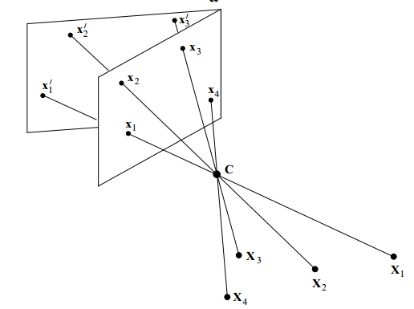
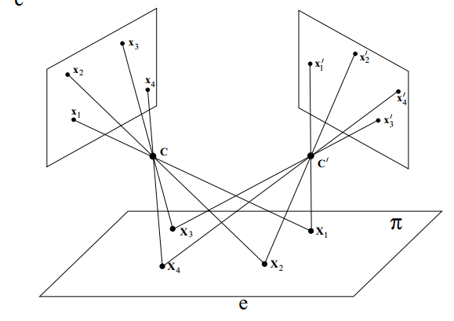

#射影变换

##概念

###Circular point

二维射影空间中任意两个圆的交点。下面是射影坐标(x,y,w)下圆方程，该方程通过两个固定点$(1, \pm i, 0)$, 这两个点就是circular point， 是在2D世界中的点。这两个点是在无穷远处直线上的两个点，他在images空间中投影是什么？
$$
(\frac{x}{w}-a)^2 + (\frac{y}{w}-b)^2=r^2
$$

$$
(x-aw)^2 + (y-bw)^2=r^2w^2
$$

将$(1, \pm i, 0)$带入上面的公式中可以发现，这两个点在所有的圆中。

### absolute conic

三维射影空间中任意两个球均会包含的交线。这是在3D空间中的曲线。该曲线是在无穷远处的平面上的一个曲线，他在images空间中投影是什么？为什么说得出其在image中的投影区域IAC，便可以得出相机标定结果。image中的像可以想象成是无穷远处的平面投影产生，absolute conic在image中的投影是IAC
$$
(x-aT)^2 + (y-bT)^2+(z-cT)^2=r^2T^2
$$
三维空间中点为$$(x,y,z,T)$$,3D空间中的conic必定经过点$$(x,y,z,0)$$,该坐标满足
$$
x^2+y^2+z^2=0, T=0
$$
###Fundamental matrix and camera matrix

Fundamental matrix 和camera matrix是等价关系，获取其中一个便可以获得另一个

## 不同照片之间的投影关系

当两幅照片成像时相机**中心点相同**，或者3D目标**共平面时**，3D目标在两幅照片中成的像存在相应的投影关系。

$$x = H x'$$. $$H$$是$$3\times3$$的矩阵。其它情况不存在这种对应关系。

### 应用例子1

**图a**是一个由于透视变换窗口矩形形状被破坏，**图b**是利用透视变换恢复窗口形状的例子。可以认为将图a的相机保持中心位置不变，只改变相机角度进行调整，以此恢复图a中形状存在的畸变。由于图a和b相机中心位置一致，可以利用$$x=Hx'$$ 模拟像素对应关系。在图b中给出窗户的正确形状，利用此得出4个对应点，获取H变换矩阵，对图a进行校正。

### 不同类型的变换

书本***2.4节***

#### 仿射变换

保持平行特征，直线特征，丢失角度。转换矩阵包括六个自由度
$$
x'  = H_Ax= \begin{vmatrix} 
A & t \\
0^T & 1 \\
\end{vmatrix}
$$

#### Projective 射影变换

保持直线特征，丢失角度、平行特征，转换矩阵具有八个自由度，因为参数的比例具有意义。

####不同变换保留的性质

### 应用例子2

* 利用无穷远处直线性质，恢复原始图片部分特征

从一般射影变换到仿射变换。从图片中找到无穷远直线的投影，利用投影变换恢复投影后的直线到无穷远处，通过该变换恢复图片在仿射变换中应该存在的性质。

<u>仿射变换能够使无穷远处的直线，仍然存在无穷远处</u>

* 利用角度信息恢复特征

  ***文中2.7部分***

<u>利用垂直性质，从仿射变换中恢复真实角度，长度比例信息。</u>

利用conic 对成像图片中线段角度进行度量。利用直角关系恢复投影矩阵，从而恢复原图进过similar变换后的结果。（保留长度比例，角度信息）

利用conic在成像后的图片中获取线段在3D空间中真实角度关系。l和m是成像图片中直线。

投影图片中，conic曲线和原图片关系如下。利用垂直直线，可以求解获取k矩阵（取v=0）k矩阵是仿射变换部分，v矩阵是射影变换部分

一般射影矩阵可以分解如下。

##3D空间投影到2D空间

下面相机内参与理想CCD摄像机相比存在一个s。这是考虑到CCD摄像机可能存在成像时的x，y方向不严格垂直的情况。比如<u>相机光轴和成像平面不严格垂直</u>时，便会产生这种情况。

在该情况下，转换矩阵一共有11个自由度。K: 5, R: 3,C: 3。此时与一般转换矩阵$$3\times4$$，具有相同大小的自由度。$$M=KR$$,非奇异的时候，成为<u>finite projective cameras</u>.
$$
P=KR[I|-\widetilde{C}]
$$

$$
P = M[I|M^{-1}P_4]=KR[I|-\widetilde{C}]
$$

###投影矩阵参数具体物理意义

####相机中心在图片中的成像

***书6.2节***

####相机中心点在图片中的投影

相机中心经过投影矩阵在图片中所成像是$$(0,0,0)$$, 因为将相机中心3D世界坐标$$(C,1)$$带入到转换矩阵$$P=[M|P_4]$$中得出投影坐标为(0,0,0)。

在$PC=0$的条件下，由前面两个公式可知经过相机中心C和另一点A的射线在相机中成像于同一点，这个符合C是相机中心的现象。

#### 矩阵P列向量物理意义

投影矩阵P中前三个列向量，是世界坐标系三个坐标轴方向的消失点(vanishing point)。世界坐标系x,y,z方向向量分别是(1,0,0,0),(0,1,0,0)(0,0,1,0). 第4列$P_4$是世界坐标系原点(0,0,0,1)在图像中所成的像.

*什么是vanishing point*？

####矩阵P行向量物理意义

投影矩阵P中三个行向量，对应了相机三个方向平面，其中$P_3$是主平面，垂直于相机坐标系的z轴，$P_2$是在过相机中心和成像坐标系x轴的平面。$PX=(*,0,1)$, 空间点X在相机中的像，其y坐标始终为0， 要求$P_2X=0$, 则X在法向量为$P_2$的平面上，该平面过相机中心和成像坐标系x轴。同理得出$P_1$是过相机中心和成像坐标系y轴的平面。因为$PC=0$，所以相机中心点，同时存在前面提到的三个平面中.

#### 由一个成像点，确定3D空间射线方向

***文章6.2.2***

已知空间中一个成像点，可以确定一条射线。首先，相机中心在世界坐标系中的坐标可以得出为C。再需要给出一个在射线中的点即可确定该射线的方向。C是相机中心在世界坐标系中的坐标$PC=0$,$P^+$是投影矩阵P的伪逆。

<u>上面公式为什么可以表示过两个点的射线？过两点A，C的直线不是用下面的方程表示的吗？</u>
$$
(1-\lambda)A+\lambda C
$$
**原因如下：**
$$
P\cdot X(\lambda)=P(P^+x+\lambda C)=PP^+x +\lambda PC=x
$$
从上面的公式可以看出射线$X(\lambda)$在相机中的所成的像的确就是想点x，这一点验证了$X(\lambda)$的确就是像点x对应的射线。如果采用一般的形式$(1-\lambda)A+\lambda C$,则$P((1-\lambda)A+\lambda C))=(1-\lambda)PA=(1-\lambda)x$,由于x是homogeneous 坐标，尺度系数$(1-\lambda)$没有意义, 所以其仍是投影为x的射线。这两者表达是一致的。

当$P=[M|P_4]$中$M$是非奇异时，像点x对应的摄像还可以有另一种更具体的表达。$\widetilde{C}=-M^{-1}P_4$.过像点x的射线与无穷远处平面交点为$X_0^T=[x_0^T|0]$,则
$$
PX_0=Mx_0=x
$$
得出$x_0=M^{-1}x$,最终射线表达如下。

### cameras at infinity

无穷远处的摄像机是指$P=[M|P_4]$ 中$M$是奇异的。$P$中最后一行是(0,0,0,1)时称为affine camera，原因是<u>无穷远处的点经过投影后仍然在无穷远处</u>

看到第8章

